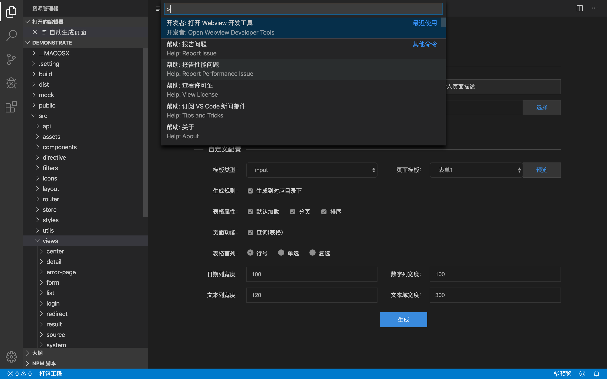

# 快速上手

### 快速新建页面

- 统一前端IDE提供了常用模版，通过常用模版可以快速的创建前端页面代码。pages用于存放页面，选择pages目录右键，选择新建页面，然后在打开的模版导航窗口中选择页面

### 快速调试

- 帮助菜单中打开切换开发人员工具即可打开调试工具

- 调试效果

### 代码自动构建页面

- pages作为存放页面的地方，选择pages目录，右键选择代码自动构建
- 可自行选择代码生成的要素，点击生成代码

### 自动补全

- 用户可以根据自动补全的信息快速新建组件

### 快速编译打包

- 由于编译的过程是执行npm run build的过程，该过程有点慢，请耐心等待

### 模版升级

### 项目预览

- 预览流程设计的思路为：
  - 1:先启动插件的node环境，然后通过指令去启动用户端的代码
  - 2:选择想要预览的内容，右键选择预览
- 所以需要先启动服务，然后在去预览。
- 倘若直接选择vue文件预览，他依旧回去执行启动服务，然后开始预览

